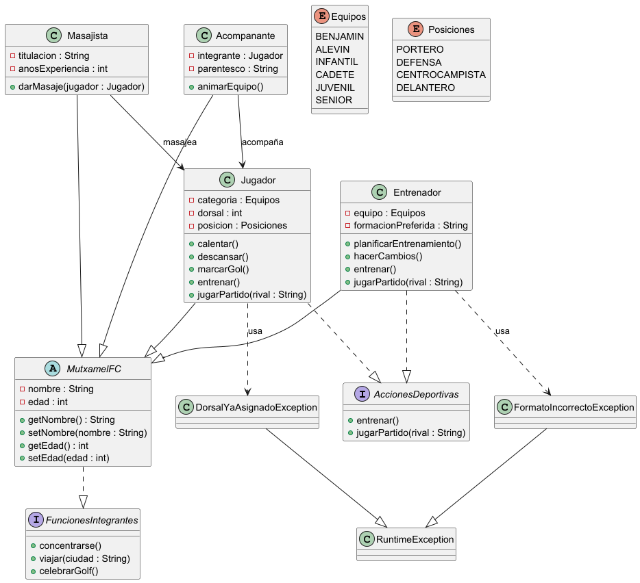

# Práctica 1. Sistema de pago para e-commerce

## ÍNDICE

1. [Intro](#1-intro)
2. [Estructura de clases](#2-estructura-de-clases)
    * Diagrama de clases UML
    * Código de PlantUML
    * Clases
3. [Programa principal](#3-programa-principal)
4. [Entrega](#5-entrega)

---

### 1. Intro

> La práctica consiste en el mantenimiento de un club.
>


---

### 2. Estructura de clases

#### Diagrama de clases UML



#### Código de PlantUML

```
@startuml

' ===================== INTERFACES =====================

interface AccionesDeportivas {
    + entrenar()
    + jugarPartido(rival : String)
}

interface FuncionesIntegrantes {
    + concentrarse()
    + viajar(ciudad : String)
    + celebrarGolf()
}

' ===================== CLASE ABSTRACTA =====================

abstract class MutxamelFC {
    - nombre : String
    - edad : int
    + getNombre() : String
    + setNombre(nombre : String)
    + getEdad() : int
    + setEdad(edad : int)
}

MutxamelFC ..|> FuncionesIntegrantes

' ===================== ENUMS =====================

enum Equipos {
    BENJAMIN
    ALEVIN
    INFANTIL
    CADETE
    JUVENIL
    SENIOR
}

enum Posiciones {
    PORTERO
    DEFENSA
    CENTROCAMPISTA
    DELANTERO
}

' ===================== CLASES =====================

class Jugador {
    - categoria : Equipos
    - dorsal : int
    - posicion : Posiciones
    + calentar()
    + descansar()
    + marcarGol()
    + entrenar()
    + jugarPartido(rival : String)
}

class Entrenador {
    - equipo : Equipos
    - formacionPreferida : String
    + planificarEntrenamiento()
    + hacerCambios()
    + entrenar()
    + jugarPartido(rival : String)
}

class Masajista {
    - titulacion : String
    - anosExperiencia : int
    + darMasaje(jugador : Jugador)
}

class Acompanante {
    - integrante : Jugador
    - parentesco : String
    + animarEquipo()
}

' ===================== HERENCIA =====================

Jugador --|> MutxamelFC
Entrenador --|> MutxamelFC
Masajista --|> MutxamelFC
Acompanante --|> MutxamelFC

' ===================== IMPLEMENTACIONES =====================

Jugador ..|> AccionesDeportivas
Entrenador ..|> AccionesDeportivas

' ===================== RELACIONES =====================

Acompanante --> Jugador : acompaña
Masajista --> Jugador : masajea

' ===================== EXCEPCIONES =====================

class DorsalYaAsignadoException
class FormatoIncorrectoException

DorsalYaAsignadoException --|> RuntimeException
FormatoIncorrectoException --|> RuntimeException

Jugador ..> DorsalYaAsignadoException : usa
Entrenador ..> FormatoIncorrectoException : usa

@enduml
```

#### Clases

* Clase *AccionesDeportivas.java*

* Clase *Acompanante.java*

* Clase *AppMantenimiento.java*

* Clase *AppMutxamelFC.java*

* Clase *DorsalYaAsignadoException.java*

* Clase *Entrenador.java*

* Clase *Equipos.java*

* Clase *FormatoIncorrectoException.java*

* Clase *FuncionesIntegrantes.java*

* Clase *Jugador.java*

* Clase *Masajista.java*

* Clase *MutxamelFC.java*

* Clase *Posiciones.java*


---

### 3. Programa principal

El programa se ejecuta desde **AppMutxamelFC** y para la gestión del mantenimiento **AppMantenimiento**.

En la **AppMantenimiento** el usuario escogerá entre diferentes opciones e introducirá todos los datos para añadir un nuevo jugador al club. Se utilizan los siguientes métodos:

* **menu()**
* **mantenimientoJugadores()**
* **crearJugador()**
* **modificarJugador()**
* **crearAcompanantes()**
* **consultarEquipos()**


---

### 5. Entrega

* [x] Link GitHub
* [x] Documentación Javadoc
* [x] Markdown
* [x] Video explicativo
